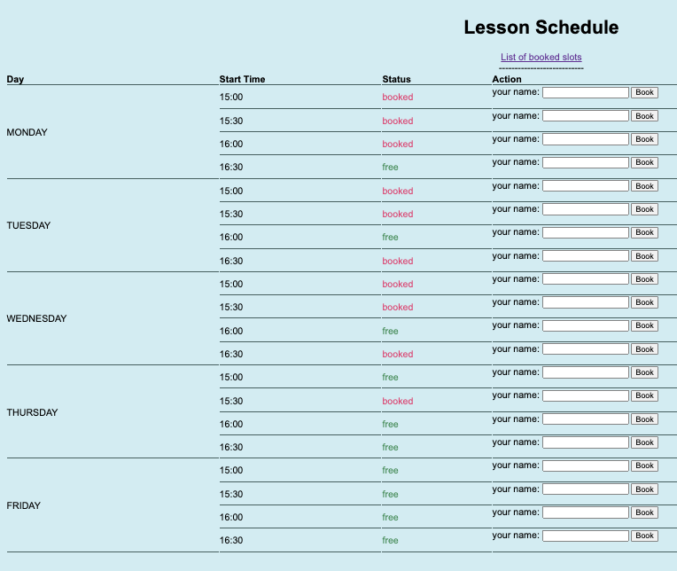
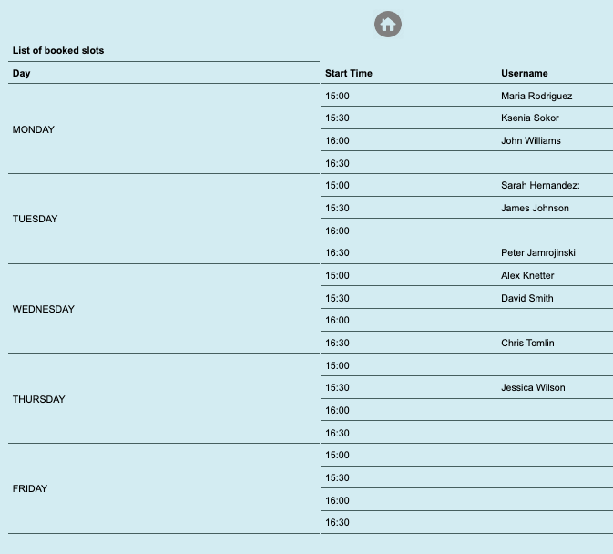

Peter Sokor individual project: "TimeSlotManager"

## Project Description:

## Problem Statement

-For many years, music teachers have faced challenges in effectively organizing and managing schedules for music lessons with their students. Existing methods, such as manual -schedule keeping, paper notebooks, or the use of shared calendars, often prove inconvenient and inefficient. This leads to difficulties in booking lesson times, tracking student -availability, and exchanging schedule-related information.

-Most music teachers also encounter the need to send lesson schedules to students and receive confirmations from them. This process can be cumbersome and time-consuming, especially -when considering individual preferences and schedule changes.

-This application helps music teachers to easily manage lesson schedules, рelps to keep track of the list of students who have booked time for a lesson and send reminder messages.

## Technologies and Tools:

- **Programming Language:** Java
- **ORM Framework:** Hibernate
- **Logging:** Log4J
- **Authentication and Authorization:** Cognito AWS
- **Frontend:** Thymeleaf (HTML templating)
- **Database Management System:** MySQL
- **Framework:** Spring Boot

## Project Components:

### 1. Controllers:

#### a. `BookingController`:

- Handles requests related to booking and displaying schedules.
- Implements methods for displaying the schedule (`showBookingSchedule`) and booking a time slot (`bookTimeSlot`).

#### b. `ScheduleController`:

- Responsible for displaying schedules and lists of booked slots.
- Implements methods for displaying schedules (`showSchedule`) and lists of booked slots (`showAllTimeSlots`).

### 2. Services:

#### a. `BookingService`:

- Provides logic for booking and displaying time slots.
- Interacts with repositories (`TimeSlotRepository`, `BookingRepository`).

### 3. Repositories:

#### a. `BookingRepository`:

- Interface for interacting with the database for the `Booking` entity.

#### b. `TimeSlotRepository`:

- Interface for performing database operations related to the `TimeSlot` entity.

### 4. Entities:

#### a. `TimeSlot`:

- Represents the entity of a time slot.
- Contains information about the day of the week, start time, status, and occupation.

#### b. `Booking`:

- Represents the entity of a booking.
- Associated with a time slot through a "many-to-many" relationship.

## Design Documentation
[UserStories](DesignDocuments/userStories.md)
[Tasks](DesignDocuments/tasks.md)
[CreateTableSql](DesignDocuments/CreateTimeSlotTable.sql)

## Plans to work on:

1. **Add Cognito Authentication and Authorization:**
    - Integrate with AWS Cognito or a similar service to enhance security and user identification.

2. **Improve the Interface:**
    - Develop a more appealing and user-friendly interface to enhance the user experience.

3. **Work on Unit Tests:**
    - Develop additional unit tests to ensure the stability and reliability of the application.
   
4. ** Deploy on AWS **
    - To deploy this project on AWS BeansTalk and send link to other students
